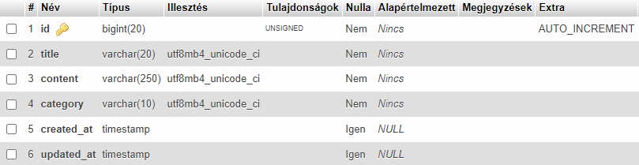

# D4S Test

- Laravel CRUD blog app. The project is dependant on Laravel 8.

## Installation

- Open XAMPP control panel then start Apache and MySQL.

- Open [phpmyadmin](http://localhost/phpmyadmin) and create a database named 'laravel'. Note that it should be served on port **3306**. Change it accordingly in the .env file if needed.

- Clone the repository into the ~xampp/htdocs directory.

- Migrate the database.

```bash
php artisan migrate
```

- Seed the database with initial values.

```bash
php artisan db:seed
```

- Start the application. Once it's built, the app will be served on port **8000**.

```bash
php artisan serve
```

## Blog schema

